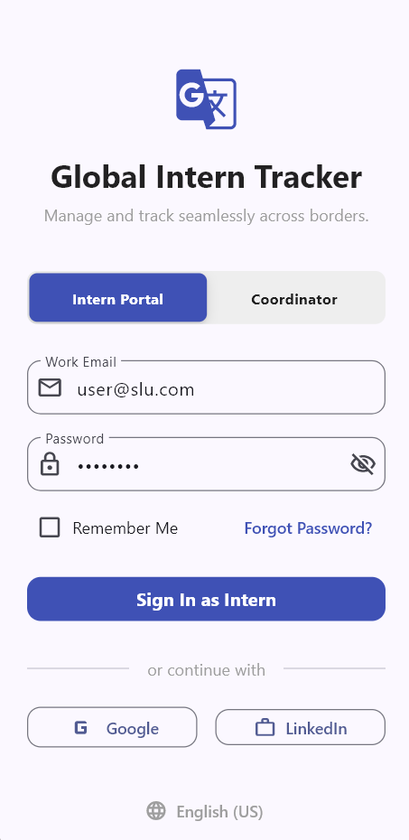
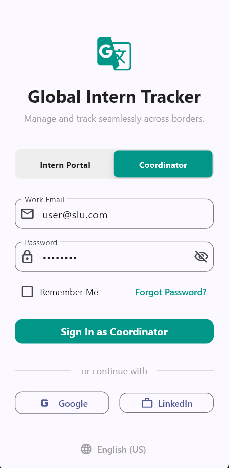
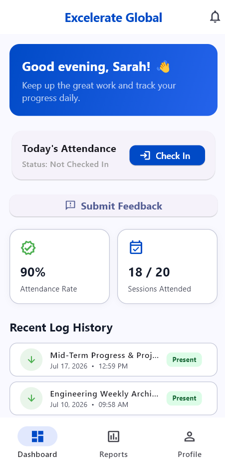
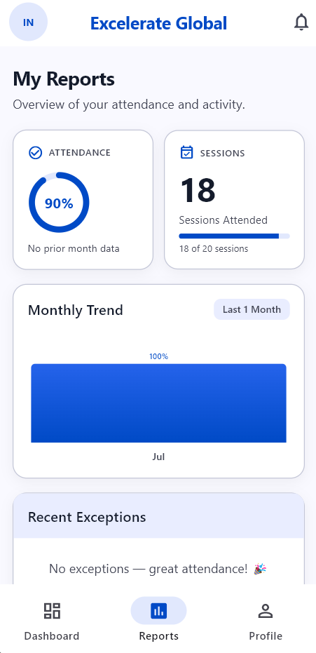
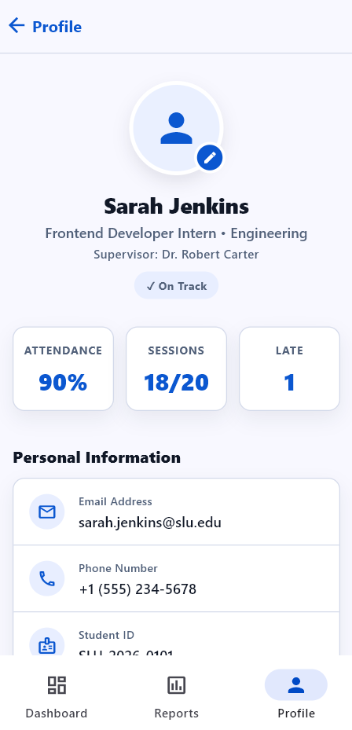
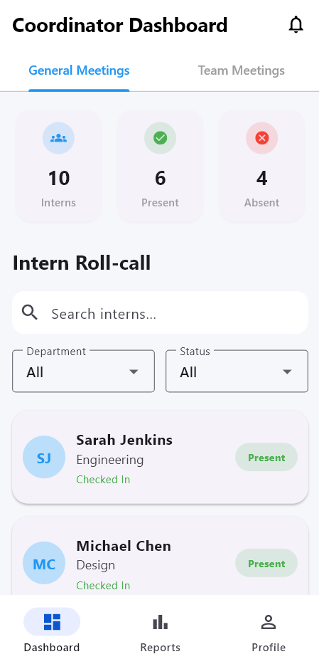
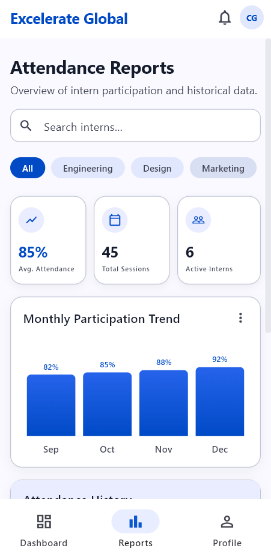
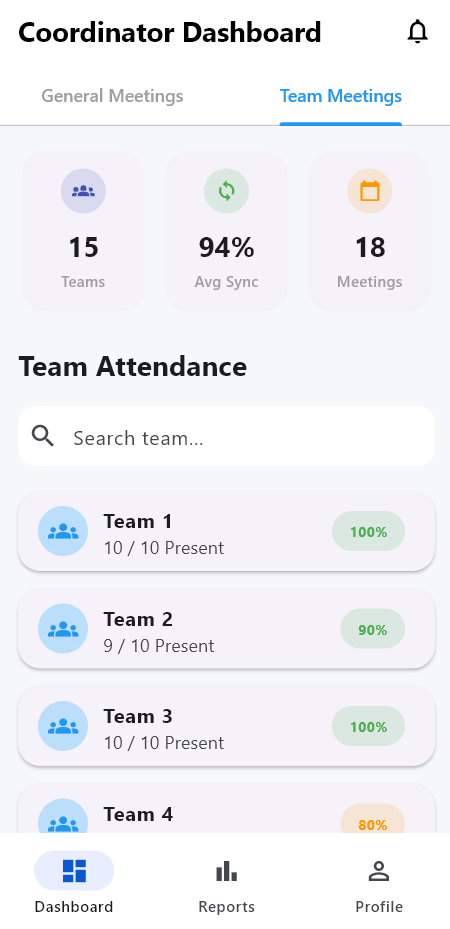
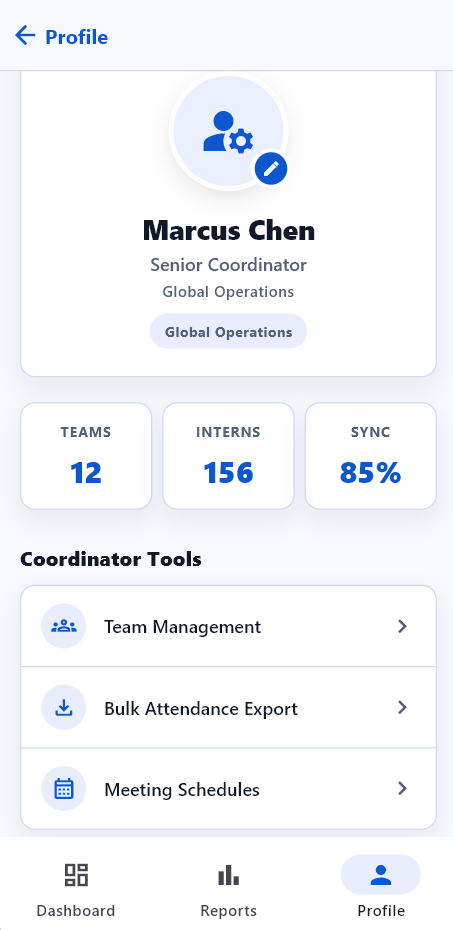
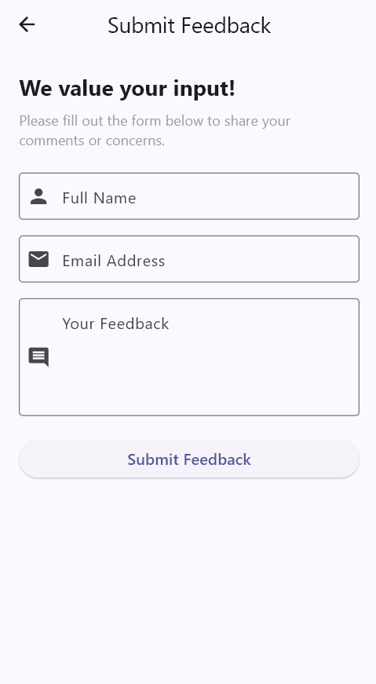

<div align="center">

# 🌐 Global Intern Tracker
### SLU Attendance App — Capstone Internship Project

**Track. Manage. Report.** A cross-platform Flutter app for managing intern attendance across global programs at Saint Louis University.

[](https://flutter.dev)
[](https://dart.dev)
[](https://flutter.dev/multi-platform)
[](#)

</div>

---

## 📋 Table of Contents
- [Project Overview](#-project-overview)
- [App Screenshots](#-app-screenshots)
- [Features](#-features)
- [Tech Stack](#-tech-stack)
- [Project Structure](#-project-structure)
- [Getting Started](#-getting-started)
- [Test Credentials](#-test-credentials)
- [Data & API Layer](#-data--api-layer)
- [Weekly Changelog](#-weekly-changelog)
- [Contributors](#-contributors)

---

## 📖 Project Overview

**Global Intern Tracker** is a Flutter mobile/desktop application built as a capstone group project for the SLU internship program. It provides a dual-role system — **Interns** can track their own attendance, view reports, and submit feedback; **Coordinators** can monitor all interns, manage meetings, and review participation metrics across departments.

The app connects to a structured JSON dataset via a `MockApiService` layer (designed to be swapped with a live REST backend), making it production-ready in architecture.

### 🎯 Key Goals
- Provide real-time attendance visibility for interns across programs
- Give coordinators a filterable, sortable view of intern participation
- Support both general and team-specific meeting types
- Collect structured intern feedback with form validation

---

## 📸 App Screenshots

> **📌 Screenshots will appear here once added.** See the [Adding Screenshots Guide](#-adding-screenshots-to-github) below.

### 🔐 Login Screen
| Intern Login | Coordinator Login |
|:---:|:---:|
|  |  |

### 📊 Intern Portal
| Dashboard | Reports | Profile |
|:---:|:---:|:---:|
|  |  |  |

### 🗂️ Coordinator Portal
| Dashboard | Intern Reports | Meeting Details | Profile |
|:---:|:---:|:---:|:---:|
|  |  |  |  |

### 📝 Other Screens
| Feedback Form |
|:---:|
|  |

---

## ✨ Features

### 👤 Intern Portal
- **Role-based Login** — Sliding segmented control switches between Intern / Coordinator modes
- **Intern Dashboard** — Live check-in/check-out, attendance streak, upcoming meetings, shimmer loading skeleton
- **Attendance Reports** — Monthly trend chart (custom canvas painter), exception log, participation ring indicator
- **Profile Screen** — Student ID, department, supervisor, contact info, status badge
- **Feedback Form** — Validated fields (name, email, message) with success snackbar

### 🗂️ Coordinator Portal
- **Coordinator Dashboard** — Tabbed view: General Meetings / Team Meetings with meeting cards
- **Meeting Details Screen** — Date, time, location, agenda & notes
- **Intern Reports Screen** — Searchable, filterable intern list (department, status), participation progress bars, status chips (On Track / Needs Review / At Risk)
- **Coordinator Profile** — Role info, logout navigation back to login

### 🔧 Technical Features
- **MockApiService** — Singleton JSON-backed service with 500ms simulated network delay and in-memory caching
- **Python Mock Server** (`mock_server.py`) — Flask-based REST API for local integration testing
- **Shimmer Loading Skeletons** — AnimationController-driven pulse animations while data loads
- **Bottom Navigation Shell** — `IndexedStack`-based shell navigation preserving state across tabs
- **Form Validation** — Email regex, minimum length, required field checks throughout
- **Material 3 Theme** — Consistent indigo/teal color system with role-based theming

---

## 🛠️ Tech Stack

| Layer | Technology |
|-------|-----------|
| **Framework** | Flutter 3.44.6 (stable) |
| **Language** | Dart 3.12.2 |
| **State Management** | `StatefulWidget` + `FutureBuilder` |
| **Navigation** | `Navigator` + `IndexedStack` shell |
| **Data Layer** | JSON asset + `MockApiService` singleton |
| **Mock Server** | Python + Flask (`mock_server.py`) |
| **Target Platforms** | Android, iOS, Windows Desktop |
| **Design System** | Material Design 3 |

---

## 📁 Project Structure

```
slu_attendance_app/
├── lib/
│   ├── main.dart                          # App entry point (MaterialApp)
│   ├── models/
│   │   ├── attendance_models.dart         # Intern, Meeting, AttendanceRecord models
│   │   └── meeting_model.dart             # Meeting detail model
│   ├── screens/
│   │   ├── login_screen.dart              # Dual-role login with segmented control
│   │   ├── intern_main_screen.dart        # Intern bottom nav shell
│   │   ├── intern_dashboard.dart          # Check-in, streaks, upcoming meetings
│   │   ├── intern_report_page.dart        # Trend chart, exceptions, participation ring
│   │   ├── intern_profile_screen.dart     # Intern info, stats, logout
│   │   ├── coordinator_main_screen.dart   # Coordinator bottom nav shell
│   │   ├── coordinator_dashboard.dart     # General & Team meeting tabs
│   │   ├── coordinator_screen_report.dart # Filterable intern attendance list
│   │   ├── coordinator_profile_screen.dart# Coordinator profile & logout
│   │   ├── meeting_details_screen.dart    # Meeting info card + agenda
│   │   └── feedback_screen.dart           # Validated feedback submission form
│   ├── services/
│   │   └── mock_api_service.dart          # Singleton data service (JSON to models)
│   └── widgets/
│       └── profile_widgets.dart           # Shared reusable profile UI components
├── assets/
│   ├── sample_data.json                   # Structured mock dataset
│   └── screenshots/                       # App screenshots (add yours here)
├── mock_server.py                         # Python Flask REST API for testing
└── pubspec.yaml
```

---

## 🚀 Getting Started

### Prerequisites
- [Flutter SDK](https://docs.flutter.dev/get-started/install) >= 3.0
- Dart >= 3.0 (bundled with Flutter)
- Android Studio / VS Code with Flutter plugin
- For mock server: Python 3.x + `pip install flask`

### 1. Clone the Repository
```bash
git clone https://github.com/CynthiaJC/SLU_Attendance_App.git
cd SLU_Attendance_App
```

### 2. Install Flutter Dependencies
```bash
flutter pub get
```

### 3. Run the App
```bash
# Android emulator or physical device
flutter run

# Windows desktop
flutter run -d windows

# Chrome (web preview)
flutter run -d chrome
```

### 4. (Optional) Run the Python Mock Server
```bash
pip install flask
python mock_server.py
```
> The mock server runs on `http://localhost:5000` and serves the same data as `sample_data.json`.

---

## 🔑 Test Credentials

| Field | Value |
|-------|-------|
| **Email** | `user@slu.com` |
| **Password** | `slu12345` |
| **Intern ID** | `INT-001` (pre-wired at login) |

> Select **Intern Portal** or **Coordinator** from the segmented toggle before logging in.

---

## 🗃️ Data & API Layer

The app uses a **MockApiService** singleton that reads from `assets/sample_data.json`. The JSON contains:

- **`interns[]`** — 10+ intern records with attendance stats, department, supervisor, status
- **`meetings[]`** — General & Team meeting records with attendance breakdowns
- **`attendanceRecords[]`** — Individual per-intern per-meeting logs with time-in/out
- **`summary`** — Aggregated totals for dashboard stats

The service introduces a **500ms simulated delay** so loading skeleton animations are visible during development. Replacing `MockApiService` with a real HTTP client requires no changes to the UI layer.

---

## 📅 Weekly Changelog

### Week 1 — July 19–20, 2026 · _Foundation & Scaffolding_

> Established the project repository, core navigation architecture, and initial screen skeletons.

| Date | Contributor | Change |
|------|-------------|--------|
| Jul 19 | Team | Added new login screen with role-based placeholder credentials |
| Jul 19 | Team | Added initial intern report page skeleton |
| Jul 20 | MohammedHamidAli | Added placeholder login credentials for testing |
| Jul 20 | Team | Added coordinator screen report (initial version) |
| Jul 20 | Team | Intern screen & Programs list scaffold |
| Jul 20 | Team | Created data models (Intern, Meeting) |
| Jul 20 | Team | Resolved login screen merge conflict |
| Jul 20 | Team | Removed unnecessary model screen & duplicate SLU subfolder |
| Jul 20 | Team | Login page linked with intern page |
| Jul 20 | Team | Added navigation: Login → Coordinator Dashboard |
| Jul 20 | Team | Implemented coordinator and intern profile screens |
| Jul 20 | Team | Added navigation from dashboard to reports screen |
| Jul 20 | Team | **Refactor:** Unified shell navigation architecture (`IndexedStack`) |
| Jul 20 | Team | Added Intern Dashboard with attendance tracking |

---

### Week 2 — July 25–26, 2026 · _Data Layer & Feedback Form_

> Introduced the mock data pipeline, JSON dataset, Python server, and a validated feedback form.

| Date | Contributor | Change |
|------|-------------|--------|
| Jul 25 | Team | Added sample JSON dataset with 10+ interns, meetings, attendance records |
| Jul 25 | Team | Added Python mock API server (`mock_server.py`) for backend integration testing |
| Jul 25 | Team | Added Flutter attendance models (`Intern`, `Meeting`, `AttendanceRecord`) |
| Jul 26 | Team | Added `MockApiService` — singleton JSON reader with 500ms delay + caching |
| Jul 26 | Team | Added validated feedback form with name/email/message fields and error states |
| Jul 26 | Team | Resolved merge conflicts between feature branches |

---

### Week 3 — July 27, 2026 · _Real Data Integration_

> Connected all UI screens to live data from the MockApiService; added shimmer loading states.

| Date | Contributor | Change |
|------|-------------|--------|
| Jul 27 | Team | Connected intern dashboard to real data — check-in state, meetings, attendance stats |
| Jul 27 | Team | Connected intern reports page to real data — trend chart, exception log, participation ring |
| Jul 27 | Team | Connected intern profile screen to real data — student ID, department, supervisor, stats |
| Jul 27 | Team | Connected coordinator dashboard to real data — General/Team meeting tabs with live counts |
| Jul 27 | Team | Updated login credentials and logout navigation flows |
| Jul 27 | Team | Added shimmer skeleton animations for all async-loading screens |

---

### Week 4 — August 2–3, 2026 · _Polish & Meeting Details_

> Final UI polish pass, meeting details screen, reusable profile widgets, coordinator report improvements.

| Date | Contributor | Change |
|------|-------------|--------|
| Aug 2 | Team | Added `MeetingDetailsScreen` — date, time, location card + agenda/notes panel |
| Aug 2 | Team | Added `MeetingModel` — dedicated model for meeting detail navigation |
| Aug 2 | Team | Added `profile_widgets.dart` — reusable profile UI components shared across roles |
| Aug 2 | Team | Polished feedback form with improved validation messages and layout |
| Aug 3 | Team | Dashboard Polish pass — color system refinement, spacing consistency, card elevation |
| Aug 3 | Team | Coordinator dashboard real-data integration finalized |

---

## 👥 Contributors

| Name | GitHub | Role |
|------|--------|------|
| Cynthia JC | [@CynthiaJC](https://github.com/CynthiaJC) | Project Lead, Coordinator Screens |
| Mohammed Hamid Ali | — | Login Screen, Intern Screens |
| Team Member 3 | — | Data Models, Mock API |
| Team Member 4 | — | Reports, Feedback Form |

---

## 📄 License

This project is developed for academic purposes as part of the Excelerate Internship Program capstone requirement. All rights reserved by the contributing students and Saint Louis University.

---

<div align="center">
  <sub>Built with Flutter · SLU Internship Capstone 2026</sub>
</div>
